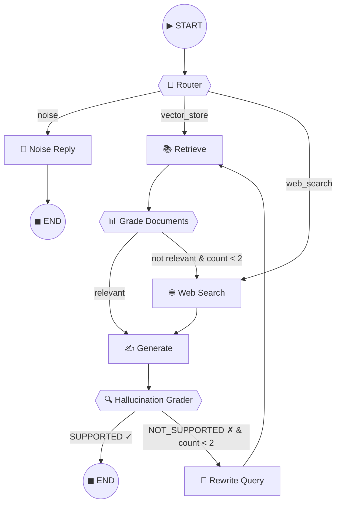

# KGateway

**企业级 AI 基础设施平台 —— 统一 LLM 网关、多模态文档解析与自适应 RAG 引擎**

```
██╗  ██╗██████╗       ██╗  ██╗ █████╗ ██████╗ ███████╗██████╗  ██████╗ ███████╗
██║ ██╔╝██╔══██╗      ██║  ██║██╔══██╗██╔══██╗██╔════╝██╔══██╗██╔═══██╗██╔════╝
█████╔╝ ██████╔╝█████╗███████║███████║██║  ██║███████╗██║  ██║██║   ██║███████╗
██╔═██╗ ██╔══██╗╚════╝██╔══██║██╔══██║██║  ██║╚════██║██║  ██║██║   ██║╚════██║
██║  ██╗██████╔╝      ██║  ██║██║  ██║██████╔╝███████║██████╔╝╚██████╔╝███████║
╚═╝  ╚═╝╚═════╝       ╚═╝  ╚═╝╚═╝  ╚═╝╚═════╝ ╚══════╝╚═════╝  ╚═════╝ ╚══════╝
```

[](LICENSE)
[](https://www.python.org/downloads/)
[](https://www.docker.com/)

---

## 🎯 项目概览

KGateway 是一个**生产级 AI 基础设施平台**，由四个紧密协作的子系统组成，覆盖从文档解析、向量入库到智能检索与 LLM 网关的完整链路：

```
┌─────────────────────────────────────────────────────────────────────────┐
│                        KGateway 生态全景                                 │
├─────────────────────────────────────────────────────────────────────────┤
│                                                                         │
│  📄 OmniParse ETL        🧠 Adaptive RAG Engine     🚀 KGateway        │
│  ┌──────────────┐        ┌──────────────────┐      ┌──────────────────┐ │
│  │ PDF/图片解析  │───────▶│  自适应检索增强   │─────▶│  统一 LLM 网关   │ │
│  │ 表格识别      │        │  幻觉自纠循环     │      │  语义缓存+熔断   │ │
│  │ 智能切分      │        │  降级到 Web 搜索  │      │  多租户隔离      │ │
│  └──────────────┘        └──────────────────┘      └──────────────────┘ │
│         │                        │                         │            │
│         ▼                        ▼                         ▼            │
│  ┌──────────────┐        ┌──────────────────┐      ┌──────────────────┐ │
│  │   MinIO      │        │   Qdrant         │      │   Redis VSS      │ │
│  │   (原始文件)  │        │   (向量存储)      │      │   (语义缓存)     │ │
│  └──────────────┘        └──────────────────┘      └──────────────────┘ │
│                                                                         │
│  🤖 CC-Connect Bridge                                                      │
│  ┌──────────────────────────────────────────────────────────────────┐    │
│  │  12+ AI Agent × 12+ Chat Platform — 统一 AI 编码代理桥接层       │    │
│  └──────────────────────────────────────────────────────────────────┘    │
│                                                                         │
└─────────────────────────────────────────────────────────────────────────┘
```

### 四大子系统

| 子系统 | 语言 | 定位 | 端口 |
|--------|------|------|------|
| **[KGateway](src/)** | Python | 企业级 LLM 网关 — 统一路由、语义缓存、成本管控 | `8000` |
| **[OmniParse ETL](omniparse_etl/)** | Python | 多模态文档解析与向量入库流水线 | `8001` |
| **[LangGraph Adaptive RAG](langgraph_adaptive_rag_engine/)** | Python | 自适应检索增强生成 — 幻觉自纠与查询重写 | — |
| **[CC-Connect Bridge](cc-connect-bridge/)** | Go | AI 编码代理 × 聊天平台桥接（Claude Code, Codex 等） | — |

---

## 💎 核心能力

### 🚀 KGateway — 统一 LLM 网关

```
┌─────────────────────────────────────────────────────────────────┐
│                    REQUEST FLOW                                  │
│                                                                  │
│  Client ──▶ Circuit Breaker ──▶ Semantic Cache ──▶ Model Router │
│                                (Redis VSS)        (qwen3/deepseek│
│                                     │             /claude)      │
│                              ┌──────┴──────┐                    │
│                              │  Cache Hit  │  Cache Miss        │
│                              │   (5ms)     │  ──▶ FSM Agent     │
│                              └─────────────┘      Runtime       │
│                                                        │        │
│                                              ┌─────────┴──────┐ │
│                                              │ Hybrid RAG     │ │
│                                              │ Dense + Sparse  │ │
│                                              │ + RRF + Rerank  │ │
│                                              └────────────────┘ │
│                                                        │        │
│                                              ┌─────────┴──────┐ │
│                                              │ SSE Streaming  │ │
│                                              └────────────────┘ │
└─────────────────────────────────────────────────────────────────┘
```

**核心特性（含源码定位）：**

| 特性 | 描述 | 源码位置 |
|------|------|----------|
| **三态熔断器** | CLOSED → OPEN → HALF_OPEN 自修复，async context manager | `src/core/protection.py:50-120` |
| **双路竞速守护** | `asyncio.wait(FIRST_COMPLETED)` 心跳 vs 业务竞速，200ms 检测断连 | `src/api/routes.py:160-240` |
| **语义缓存** | Redis VSS + HNSW 余弦相似度 > 0.96 毫秒级拦截 | `src/core/cache.py:30-90` |
| **动态模型路由** | 按查询复杂度路由 + Token 成本实时估算 | `src/core/router.py:87-106` |
| **FSM Agent Runtime** | 确定性状态机 Planner→Executor，4 次迭代沙箱 | `src/agents/runtime.py:151-228` |
| **RRF 融合** | Dense + Sparse 双路召回 → Reciprocal Rank Fusion (k=60) | `src/core/fusion.py:10-50` |
| **BGE CrossEncoder 精排** | `asyncio.to_thread` 非阻塞卸载 CPU 推理 | `src/core/reranker.py:40-80` |
| **BM25 稀疏检索** | 2-gram 中文分词 + 多租户硬过滤 | `src/db/bm25_client.py:30-100` |
| **多租户隔离** | Qdrant HNSW 索引级 Bitmap 预过滤 | `src/db/qdrant_client.py:50-100` |
| **全链路可观测性** | LangFuse 追踪 + Metrics 聚合端点 | `src/core/observability.py:1-100` |

### 📄 OmniParse ETL — 多模态文档解析

**4 阶段 ETL Pipeline：**

```
Upload (FastAPI) ──▶ Parse (Unstructured PDF) ──▶ Chunk (EnterpriseChunker) ──▶ Ingest (Qdrant)
      │                      │                         │                         │
  MinIO 存储           跨页表格还原              格式感知切分              BGE 向量化入库
  Celery 异步          VLM 图片描述              表格永不碎片化            租户元数据索引
```

> ⚠️ OmniParse ETL 已拆分为独立仓库，以下路径为参考。

| 特性 | 源码位置 |
|------|----------|
| **多模态 PDF 解析** (文本+表格+图片) | `omniparse_etl/src/parsers/pdf_parser.py:30-80` |
| **EnterpriseChunker** 格式感知切分 | `omniparse_etl/src/parsers/chunker.py:30-100` |
| **表格防断裂** — 跨页表格整体保留 | `omniparse_etl/src/parsers/chunker.py:80-100` |
| **Celery 分布式 Worker** | `omniparse_etl/src/worker/tasks.py:30-80` |
| **Qdrant 向量化入库** (100 pts/batch) | `omniparse_etl/src/worker/ingestion.py:40-100` |
| **MinIO 流式上传** | `omniparse_etl/src/storage/minio_client.py:30-60` |

### 🧠 LangGraph Adaptive RAG — 自适应检索增强生成



> ⚠️ LangGraph Adaptive RAG 已拆分为独立仓库，以下路径为参考。

| 特性 | 源码位置 |
|------|----------|
| **Pydantic 运行时校验** | `src/state.py:17` (AgentState) / `src/chains/router.py:9` (QueryRoute) |
| **`asyncio.gather` 并行评分** | `src/nodes/grade_documents.py:18-33` |
| **MemorySaver 断点恢复** | `src/graph.py:232-233` / `src/main.py:30,41` |
| **幻觉自纠循环 (DCG)** | `src/graph.py` — 8 节点 + 3 条件路由边 |
| **优雅降级 Qdrant→Web** | `src/nodes/retrieve.py:24-30` |
| **Mock LLM 离线测试** | `src/mock_llm.py:12` / `src/graph.py:16` |

### 🤖 CC-Connect Bridge — AI 代理桥接

- **12+ AI Agent**：Claude Code, Codex, Cursor, Gemini CLI, Kimi CLI, Qoder, OpenCode, iFlow, Pi, Devin, ACP, Tmux
- **12+ Chat Platform**：飞书, Telegram, Discord, Slack, 钉钉, 企业微信, 微信, 微博, QQ, QQ Bot, LINE, WPS 写作
- **Web 管理面板**：嵌入式管理后台，无需额外依赖
- **会话管理**：`/new`, `/list`, `/switch`，空闲自动轮换

---

## 🏗️ 技术栈

```
┌─────────────────────────────────────────────────────────────────────┐
│                        TECHNOLOGY STACK                             │
├─────────────────────────────────────────────────────────────────────┤
│                                                                      │
│   🐍 Python 3.11+                                                   │
│   ────────────────                                                   │
│   • FastAPI + Uvicorn         高性能异步 Web 框架                     │
│   • Pydantic v2               数据校验与 Settings 管理                │
│   • sentence-transformers     BGE 向量化 + CrossEncoder 精排         │
│   • rank-bm25 + jieba         BM25 稀疏检索 (中文分词)               │
│                                                                      │
│   🗄️ 存储层                                                         │
│   ────────────────                                                   │
│   • Qdrant                   向量数据库 (HNSW + Bitmap 预过滤)       │
│   • Redis 7                  语义缓存 (VSS) + 消息队列               │
│   • Neo4j 5                  知识图谱                                 │
│   • MinIO                    S3 兼容对象存储                          │
│                                                                      │
│   📊 可观测性                                                        │
│   ────────────────                                                   │
│   • LangFuse                 分布式追踪                               │
│   • Prometheus               指标导出与告警                           │
│                                                                      │
│   🐳 基础设施                                                        │
│   ────────────────                                                   │
│   • Docker Compose           7 服务一键编排                           │
│   • Celery                   分布式任务队列                           │
│   • Locust                   负载测试框架                             │
│                                                                      │
│   🔧 CC-Connect Bridge                                                │
│   ────────────────                                                   │
│   • Go 1.25                  高性能桥接服务                           │
│   • BubbleTea + Lip Gloss    TUI 组件                                 │
│   • WebSocket                实时通信                                 │
│                                                                      │
└─────────────────────────────────────────────────────────────────────┘
```

---

## 🚀 快速开始

### 环境要求

- **Docker & Docker Compose**（推荐）
- Python 3.11+（本地开发）
- Go 1.25+（CC-Connect Bridge）

### 一键部署（Docker Compose）

```bash
# 克隆仓库
git clone git@github.com:wcy12378/KGateway-.git
cd KGateway-

# 启动全部 7 个服务
docker-compose up -d

# 查看服务状态
docker-compose ps
```

**启动的服务：**

| 服务 | 端口 | 说明 |
|------|------|------|
| `kgw-redis` | `6379` | 语义缓存 + 消息队列 |
| `kgw-qdrant` | `6333` / `6334` | 向量数据库 |
| `kgw-neo4j` | `7474` / `7687` | 知识图谱 |
| `kgw-minio` | `9000` / `9001` | 对象存储 |
| `kgw-gateway` | `8000` | KGateway 网关 |
| `kgw-etl-api` | `8001` | ETL 上传接口 |
| `kgw-etl-worker` | — | Celery ETL Worker |

### 验证服务

```bash
# 健康检查
curl http://localhost:8000/health

# 查看实时指标
curl http://localhost:8000/api/v1/gateway/metrics

# 打开 Swagger 文档
open http://localhost:8000/docs
```

---

## 📡 API 接口

### KGateway 网关 (port 8000)

**POST** `/api/v1/gateway/stream` — SSE 流式网关（主接口）

```json
{
  "user_id": "user_001",
  "tenant_id": "tenant_acme",
  "department": "legal",
  "question": "请解释一下最新的劳动法修订内容",
  "session_id": "550e8400-e29b-41d4-a716-446655440000",
  "advanced_reasoning": false
}
```

| 字段 | 类型 | 必填 | 说明 |
|------|------|------|------|
| `user_id` | string | ✅ | 用户标识 |
| `tenant_id` | string | ✅ | 租户 ID（数据隔离） |
| `department` | enum | ❌ | `legal` / `hr` / `engineering` / `finance` / `general` |
| `question` | string | ✅ | 用户问题 |
| `session_id` | uuid | ❌ | 会话 ID（自动生成） |
| `advanced_reasoning` | bool | ❌ | 启用高级推理模型 |

**GET** `/health` — 健康检查

**GET** `/api/v1/gateway/metrics` — 实时监控指标（JSON）

**GET** `/docs` — Swagger UI 交互文档

### OmniParse ETL (port 8001)

**POST** `/api/v1/etl/upload` — 上传文档进行解析

```bash
curl -X POST "http://localhost:8001/api/v1/etl/upload" \
  -H "Content-Type: multipart/form-data" \
  -F "file=@document.pdf"
```

---

## 📁 项目结构

```
KGateway-/
├── docker-compose.yml            # 全栈 7 服务编排
├── Dockerfile.gateway             # KGateway 容器构建
├── Dockerfile.etl                 # ETL 容器构建
├── requirements.txt               # Python 依赖
│
├── src/                           # ── KGateway: LLM 网关 ──
│   ├── main.py                    # FastAPI 入口 (port 8000)
│   ├── config.py                  # 环境变量配置
│   ├── api/routes.py              # SSE 流式端点
│   ├── agents/runtime.py          # FSM Agent 运行时
│   ├── core/
│   │   ├── cache.py               # Redis 向量语义缓存
│   │   ├── fusion.py              # RRF 排序融合
│   │   ├── reranker.py            # BGE CrossEncoder 精排
│   │   ├── router.py              # 动态模型路由 + 成本估算
│   │   ├── protection.py          # 三态熔断器
│   │   ├── observability.py       # LangFuse + Prometheus
│   │   └── schemas.py             # Pydantic 请求/响应模型
│   └── db/
│       ├── qdrant_client.py       # Qdrant 向量库 (多租户)
│       ├── bm25_client.py         # BM25 稀疏检索
│       └── neo4j_client.py        # Neo4j 图数据库
│
├── tests/                         # ── 测试 ──
│   ├── test_storage.py            # pytest 单元测试
│   └── locustfile.py              # Locust 负载测试
│
├── omniparse_etl/                 # ── OmniParse ETL: 文档解析 (独立仓库) ──
│   ├── src/
│   │   ├── main.py                # FastAPI 入口 (port 8001)
│   │   ├── api/upload.py          # 文件上传端点
│   │   ├── parsers/
│   │   │   ├── pdf_parser.py      # 多模态 PDF 解析
│   │   │   └── chunker.py         # EnterpriseChunker 格式感知切分
│   │   ├── storage/minio_client.py
│   │   └── worker/
│   │       ├── tasks.py           # Celery ETL 任务
│   │       └── ingestion.py       # Qdrant 向量化入库
│   └── requirements.txt
│
├── langgraph_adaptive_rag_engine/ # ── Adaptive RAG: 自适应检索 (独立仓库) ──
│   ├── src/
│   │   ├── main.py                # 入口 (运行 2 个 Demo Case)
│   │   ├── graph.py               # 核心 LangGraph 状态图 (8 节点)
│   │   ├── state.py               # Pydantic AgentState
│   │   ├── chains/                # 路由、评分、幻觉检测链
│   │   └── nodes/                 # 检索、评分、搜索、生成节点
│   ├── test_sanity.py
│   └── pyproject.toml
│
└── cc-connect-bridge/             # ── CC-Connect: AI 代理桥接 (独立仓库) ──
    ├── cmd/cc-connect/            # Go CLI 入口
    ├── agent/                     # 12 个 Agent 适配器
    ├── platform/                  # 12 个平台适配器
    ├── web/                       # Web 管理面板
    ├── tests/                     # 黑盒/端到端/集成测试
    └── Makefile                   # 构建 + 选择性编译
```

---

## ⚙️ 环境变量参考

| 变量 | 默认值 | 说明 |
|------|--------|------|
| **网关核心** | | |
| `KGW_HOST` | `0.0.0.0` | 网关绑定地址 |
| `KGW_PORT` | `8000` | 网关端口 |
| `KGW_WORKERS` | `4` | Uvicorn Worker 数 |
| `KGW_DEBUG` | `false` | 调试模式 |
| **Qdrant** | | |
| `QDRANT_URL` | `http://localhost:6333` | Qdrant 地址 |
| `QDRANT_COLLECTION` | `kgateway_vectors` | 向量集合名 |
| **Redis** | | |
| `REDIS_URL` | `redis://localhost:6379` | Redis 连接 |
| `REDIS_CACHE_TTL_HOURS` | `12` | 缓存 TTL |
| `REDIS_CACHE_THRESHOLD` | `0.96` | 语义缓存相似度阈值 |
| **Neo4j** | | |
| `NEO4J_URI` | `bolt://localhost:7687` | Neo4j 连接 |
| `NEO4J_USER` | `neo4j` | Neo4j 用户名 |
| `NEO4J_PASSWORD` | — | Neo4j 密码 |
| **熔断器** | | |
| `CB_FAILURE_THRESHOLD` | `5` | 失败次数阈值 |
| `CB_RECOVERY_TIMEOUT` | `60` | 恢复超时 (秒) |

---

## 📊 设计目标（待压测验证）

> ⚠️ 以下为架构设计目标值，尚未在真实负载下进行基准测试。
> 所有指标基于各模块理论延迟累加推算，实际值取决于 LLM API 响应时间、部署硬件规格和并发模式。

| 指标 | 设计目标 | 验证状态 |
|------|---------|---------|
| 请求延迟 (p99) | < 500ms | 待压测 |
| 缓存命中率 | > 40% | 待压测 |
| 吞吐量 (RPS) | > 1,000 | 待压测 |
| Agent 迭代安全 | 100% 有界终止 | ✅ 代码保证 |
| 多租户隔离 | 零泄露 | ✅ 代码保证 |

---

## 🧪 测试

### KGateway 单元测试

```bash
pip install -r requirements.txt
pytest tests/test_storage.py -v
```

### Locust 负载测试

```bash
locust -f tests/locustfile.py \
  --host=http://localhost:8000 \
  --users=100 \
  --spawn-rate=10 \
  --run-time=5m
```

### LangGraph RAG 测试

```bash
cd langgraph_adaptive_rag_engine
uv sync
uv run pytest test_sanity.py -v
```

### CC-Connect Bridge 测试

```bash
cd cc-connect-bridge
make test-fast        # 快速测试
make test-full        # 完整测试
make test-e2e         # 端到端测试
```

---

## 🤝 参与贡献

欢迎贡献代码、提交 Issue 或提出建议！

1. Fork 本仓库
2. 创建特性分支 (`git checkout -b feature/amazing-feature`)
3. 提交更改 (`git commit -m 'feat: add amazing feature'`)
4. 推送到分支 (`git push origin feature/amazing-feature`)
5. 开启 Pull Request

---

## 📄 许可证

本项目采用 [MIT License](LICENSE) 开源协议。

---

<p align="center">
  <b>Built with ❤️ for Enterprise AI Infrastructure</b>
</p>
