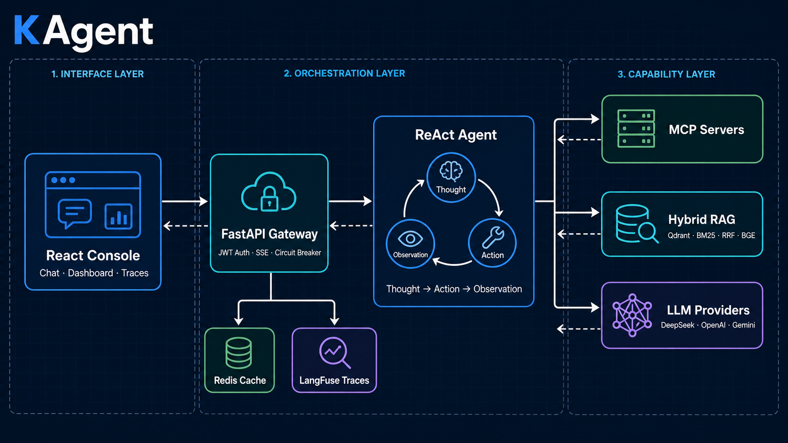

# KAgent · 企业级 AI Agent 编排平台

> 让 AI Agent 真正工作在企业的工具和知识之上。


[](https://www.python.org/)
[](https://github.com/wcy12378/KGateway-/actions/workflows/ci.yml)
[](https://wcy12378.github.io/KGateway-/)
[](https://react.dev/)
[](https://github.com/modelcontextprotocol/python-sdk)
[](#license)

KAgent 是一个可运行、可扩展、可观测的企业级 AI Agent 平台。它把 ReAct Tool Calling、Hybrid RAG、MCP、多模型路由、多租户隔离与稳定性治理组合成一条完整工程链路，而不只是一个聊天界面。

## 核心特性

- **🔌 原生 MCP 协议支持** — 基于官方 SDK 动态发现和调用外部 MCP Server 工具
- **🧠 ReAct Agent 引擎** — LLM 驱动 Thought → Action → Observation 循环，自主决定工具调用与结束时机
- **🔍 Hybrid RAG 检索** — Qdrant Dense + BM25 Sparse + RRF 融合 + BGE Reranker 精排
- **🔐 多租户隔离** — Qdrant/BM25 在存储层按租户与部门硬过滤，降低跨域数据泄露风险
- **🌐 多 Provider 支持** — DeepSeek、OpenAI、Google Gemini 通过统一抽象层按配置切换
- **📊 全链路可观测** — TraceID 串联认证、缓存、检索、Agent 与模型调用，支持 Langfuse 上报

## 系统架构



一次请求从 React Console 进入 FastAPI 网关，经过 JWT 认证、熔断与语义缓存后交给 ReAct Agent。Agent 可以选择本地工具、MCP 工具或 Hybrid RAG，并最终通过统一 Provider 层调用模型。所有关键阶段都会记录到 Trace。

## 快速开始

### 1. 获取代码

```bash
git clone https://github.com/wcy12378/KGateway-.git KAgent
cd KAgent
```

### 2. 启动基础设施

```bash
docker compose -p kagent -f 后端/docker-compose.yml up -d redis qdrant
```

### 3. 配置并启动后端

```bash
cd 后端
python -m venv .venv

# Windows PowerShell
.\.venv\Scripts\Activate.ps1

python -m pip install -r requirements.txt
Copy-Item ..\.env.example .env
# 编辑 .env，至少填写一个 KAGENT_*_API_KEY

python src/main.py
```

后端默认运行在 `http://localhost:8000`，健康检查：`GET /health`。

如需启用审核 FAQ 极速通道，将 `后端/config/faq.example.json` 复制为
`后端/config/faq.json`，按租户和部门填写已审核问答。未配置时自动跳过 FAQ，
计算器极速通道仍可使用。Redis 必须使用带 Search 模块的 Redis Stack；监控
接口会分别报告 Redis 连接状态和语义索引 readiness。

### 4. 灌入知识库数据（可选）

JSONL 每行需包含 `doc_id`、`text`、`tenant_id`、`department`：

```bash
cd 后端
python scripts/seed_qdrant.py --input "C:\path\to\knowledge_base" --recreate
```

### 5. 启动前端

```bash
cd 前端
npm install
npm run dev
```

打开 [http://localhost:5173](http://localhost:5173)，可以尝试：

```text
计算 (25 * 4 + 100) / 8 等于多少？
什么是 MCP 协议？
```

## 值得深入讨论的工程设计

### 1. LLM 驱动的 ReAct Agent

**LLM Function Calling 驱动完整 ReAct 循环。** KAgent 不再使用写死的 if-else 状态机。每轮由模型决定是否调用工具、调用哪个工具以及何时输出最终答案。OpenAI/DeepSeek 与 Gemini 的不同 `tool_calls` 格式会在 Agent 层归一化，工具异常则作为 Observation 返回给模型继续决策。

### 2. 存储层多租户隔离

**Qdrant 使用原生 Filter 在向量索引查询阶段同时约束租户与部门。** BM25 按 `tenant:department` 维护独立检索空间，而不是召回后再过滤。隔离边界因此下沉到数据访问层，减少上层逻辑错误造成的数据越界风险。

### 3. MCP 工具动态扩展

**MCP 工具与本地工具共享同一 ToolRegistry。** KAgent 使用 MCP 官方 Python SDK 管理 stdio Server 生命周期。ReAct Agent 无需知道工具来自本地还是 MCP。单个 Server 连接失败只记录告警，不阻塞应用启动；关闭时会注销动态工具并回收子进程。

### 4. Hybrid RAG 与可降级设计

**Dense 与 Sparse 召回通过 RRF 融合后进入 BGE Reranker。** Qdrant 不可用时 Dense 检索降级为空结果，不阻断主流程；Redis、Neo4j、Langfuse 等外部依赖也采用类似的 fail-safe 初始化策略。种子脚本使用确定性 UUID，支持幂等重建知识库。

### 5. 语义缓存与熔断保护

**Redis VSS 复用相似答案，三态熔断器保护下游。** 熔断器在连续失败后进入 OPEN，并在恢复窗口后进入 HALF_OPEN 探测。Dashboard 与 Traces 页面用于观察命中率、延迟、Token、成本和各阶段耗时。

## 压测结果

真实模型 Locust 压测使用 DeepSeek `deepseek-v4-flash`，以 50 个并发用户运行 3 分钟，共完成 645 次请求，失败率 0.00%，平均吞吐量 3.60 RPS。完整 SSE 端到端 P50/P95/P99 延迟分别为 8.9/31/42 秒。

本次已加载 BGE Embedding 与 Reranker；主要瓶颈为上游 LLM 生成时间。完整环境、基线对比和分接口数据见 [真实模型压测报告](./docs/reports/benchmark/benchmark_report.md) 与 [Locust HTML 报告](./docs/reports/benchmark/benchmark_report_prod.html)。

## 项目结构

```text
KAgent/
├── 后端/
│   ├── src/
│   │   ├── main.py               # FastAPI 入口与依赖生命周期
│   │   ├── config.py             # 环境配置
│   │   ├── api/                  # JWT、Token、SSE 与监控路由
│   │   ├── application/          # 聊天编排与 Hybrid RAG
│   │   ├── core/
│   │   │   ├── agent/            # ReAct Agent 引擎
│   │   │   ├── providers/        # LLM Provider 抽象
│   │   │   ├── tools/            # 本地工具注册中心
│   │   │   ├── mcp/              # MCP 官方 SDK 适配
│   │   │   ├── cache.py          # Redis 语义缓存
│   │   │   └── protection.py     # 熔断器
│   │   └── db/                   # Qdrant、BM25、Neo4j 客户端
│   ├── scripts/seed_qdrant.py    # JSONL 知识库灌入
│   └── tests/
├── 前端/                         # React 19 + Vite + TypeScript
├── docs/
│   ├── architecture.png
│   └── demo.gif
└── .env.example
```

## 关键环境变量

| 变量 | 默认值 | 说明 |
|---|---|---|
| `KAGENT_LLM_PROVIDER` | `deepseek` | 默认 LLM Provider |
| `KAGENT_DEEPSEEK_API_KEY` | — | DeepSeek API Key |
| `KAGENT_OPENAI_API_KEY` | — | OpenAI API Key |
| `KAGENT_GEMINI_API_KEY` | — | Google Gemini API Key |
| `KAGENT_ROUTING_STRATEGY` | `priority` | Provider 路由策略：`priority` 或 `latency` |
| `KAGENT_MCP_SERVERS` | 空 | stdio MCP Server 配置列表 |
| `JWT_SECRET` | 开发默认值 | JWT 签名密钥；生产环境必须覆盖 |
| `KAGENT_ALLOW_DEV_TOKENS` | `false` | 是否开放测试 Token 签发；仅本地开发开启 |
| `QDRANT_URL` | `http://localhost:6333` | Qdrant 地址 |
| `QDRANT_COLLECTION` | `kagent_vectors` | 向量集合名 |
| `REDIS_URL` | `redis://localhost:6379` | Redis 地址 |

完整示例见 [`.env.example`](./.env.example)。

## Demo 内容

README 顶部 GIF 展示了完整的核心路径：

1. ReAct Agent 调用 `calculator` 工具完成确定性计算
2. `query_knowledge` 从 Qdrant 检索 MCP 知识
3. Dashboard 展示请求量、缓存命中率和延迟分布
4. Traces 展开查看 RAG 与 Agent 阶段耗时

## License

MIT
