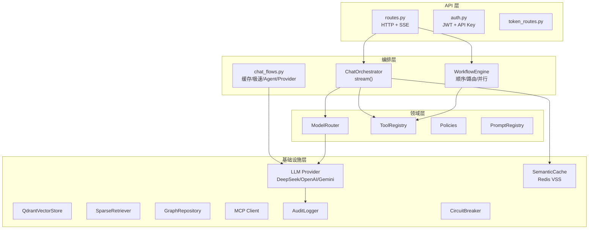
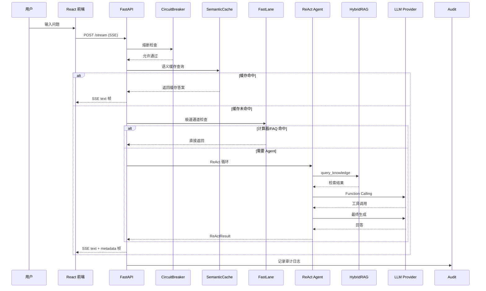

# KAgent 项目中大厂面试准备手册

> 生成日期：2026-07-02
> 基于提交：审计修复后（后端 139 tests / 前端 22 tests / CI 全绿）
> 目标岗位：AI 大模型应用 / AI Agent 工程 / Python 后端 / 平台型后端

---

## 0. 项目快速结论

### 0.1 项目是什么

KAgent 是一个**企业级 AI Agent 编排平台**，核心能力是让 AI Agent 自主调用企业工具和知识来解决问题。

### 0.2 解决了什么问题

企业中 AI 应用面临三个断层：
1. **模型碎片化** — 不同部门用不同模型，没有统一接入层
2. **工具集成难** — 每个 AI 应用都要重复对接内部系统
3. **不可控、不可观测** — Agent 执行过程黑盒，没有审计和熔断保护

KAgent 通过统一 Provider 层 + 注册式工具中心 + ReAct Agent 引擎 + 全链路可观测，把上述问题收敛到一个平台上。

### 0.3 技术栈

```
后端：Python 3.11+ / FastAPI / Pydantic v2 / httpx
前端：React 19 / TypeScript 6 / Vite 8 / Tailwind CSS 4 / Zustand
存储：Qdrant（向量库）/ Redis（语义缓存）/ Neo4j（图库）/ BM25（内存索引）
AI：DeepSeek / OpenAI / Google Gemini / BGE Embedding / BGE Reranker
协议：MCP（Model Context Protocol）/ SSE 流式
工程：GitHub Actions CI / Locust 压测 / pytest / pytest-asyncio
部署：Docker Compose（4 服务）
```

### 0.4 最值得讲的 3-5 个亮点

1. **ReAct Agent Engine** — 从 if-else 状态机重构为 LLM-driven Tool Calling，装饰器式工具注册，原生 MCP 支持
2. **多 Provider 自动 Fallback** — 三态健康状态机，连续 3 次失败自动隔离，60 秒恢复探测
3. **多 Agent 工作流** — 顺序/路由/并行三种模式，每个 Agent 独立工具白名单 + Prompt + 超时
4. **多租户存储层硬过滤** — Qdrant 原生 Filter 在向量索引层隔离租户数据，不依赖上层层逻辑正确性
5. **全链路可观测 + 审计** — TraceID 串联 5 个异步模块，工具调用审计日志带参数递归脱敏

### 0.5 目前最薄弱的 3 个地方

1. **无端到端 LLM 集成测试** — 现有 139 项测试大多基于 mock，真实 LLM 调用的正确性没有测试覆盖
2. **前端 UI 企业级细节不足** — 功能完整但交互细节还没到产品标准
3. **未部署公网可访问** — 面试官无法直接体验，只能通过 README 和 Demo GIF 了解

### 0.6 岗位契合度

| 岗位方向 | 契合度 | 原因 |
|---------|:-----:|------|
| Python 后端 | 90/100 | FastAPI + 异步全链路 + 分层架构 + CI/CD，缺少数据库操作 |
| AI 大模型应用 | 95/100 | 多 Provider 抽象、RAG、Prompt 管理、流式输出、成本管控 |
| AI Agent 工程 | 98/100 | ReAct Agent、Tool Calling、MCP、多 Agent 工作流、Agent Memory |
| 平台型后端开发 | 85/100 | 认证/限流/熔断/审计/可观测，缺少高并发验证 |
| 中间件/网关方向 | 75/100 | 有路由/缓存/熔断/限流能力，但未做性能基准和对比 |

---

## 1. 项目全局架构分析

### 1.1 分层架构



### 1.2 核心模块职责

| 模块 | 文件 | 职责 |
|:----|------|------|
| ChatOrchestrator | `application/orchestrator.py` | 请求级编排：缓存 → Agent → LLM → 响应 |
| ReActAgent | `core/agent/react_agent.py` | Thought → Action → Observation 循环 |
| ProviderFactory | `core/providers/factory.py` | LLM Provider 健康管理 + 自动 fallback |
| ToolRegistry | `core/tools/registry.py` | 装饰器式工具注册 + MCP 工具发现 |
| WorkflowEngine | `core/agent/workflow.py` | 多 Agent 工作流编排 |
| MemoryManager | `core/agent/memory.py` | 长期事实记忆提取 + 检索 |
| FastLaneService | `application/fast_lane.py` | 计算器/FAQ 极速通道，不经过 LLM |
| CircuitBreaker | `core/protection.py` | 三态熔断器（CLOSED→OPEN→HALF_OPEN）|

### 1.3 请求链路（完整流程）



### 1.4 外部依赖

| 依赖 | 用途 | 是否必须 | 降级策略 |
|:----|------|:--------:|---------|
| Qdrant | 向量存储 + 语义检索 | 否 | 降级为空结果 |
| Redis | 语义缓存（VSS） | 否 | 跳过缓存 |
| Neo4j | 知识图谱 | 否 | 跳过 |
| LLM API（DeepSeek/OpenAI/Gemini）| 模型推理 | 是 | 模拟 token 流 |
| sentence-transformers | Embedding + Reranker | 否 | Reranker 降级为 RRF |

### 1.5 扩展性

项目通过以下机制支持扩展：
- **Provider 接口**：新增模型只需实现 `LLMProvider` 抽象类
- **Tool 装饰器**：新增工具只需 `@tool()` 注册
- **MCP 协议**：外部工具通过 MCP Server 动态发现
- **Workflow**：新增工作流只需 register_workflow() 配置
- **Prompt 管理**：新模板只需 .txt 文件 + manifest 注册

**当前仓库未发现相关实现**：插件系统、租户层面的功能开关、A/B 测试框架。

---

## 2. 项目介绍话术

### 2.1 【必问】30 秒项目介绍

> "我设计了一个企业级 AI Agent 编排平台。核心思路是让 AI Agent 能够自主调用企业的工具和知识来解决问题。架构分三层：底层是统一的 LLM Provider 抽象，支持 DeepSeek、OpenAI、Gemini 一键切换；中间是 ReAct Agent 引擎，通过 Function Calling 让 AI 自主决策；上层是多 Agent 工作流，支持顺序、路由、并行三种协作模式。项目还接入了 MCP 协议，做了语义缓存、审计日志和全链路追踪，目前 139 项测试通过，CI 全绿。"

### 2.2 【必问】1 分钟项目介绍

> "KAgent 是一个企业级 AI Agent 编排平台。为什么做这个？因为现在企业的 AI 应用有三个断层：模型碎片化、工具集成难、执行过程不可控。"
>
> "我负责整体架构设计和核心模块开发。项目后端用 FastAPI 做异步网关，前端用 React 19 + TypeScript，存储层接了 Qdrant、Redis 和 Neo4j。"
>
> "核心功能包括：多 Provider 统一接入和自动 fallback、ReAct Agent 引擎（LLM 自己决定调什么工具）、多 Agent 工作流（顺序/路由/并行三种模式）、MCP 协议支持、语义缓存、审计日志、Prompt 版本管理。"
>
> "最有技术含量的几个点：一是 Agent 从最初的 if-else 状态机重构成了 LLM-driven 的 Tool Calling；二是多租户的存储层隔离是下放到 Qdrant 原生 Filter 里的，不依赖上层代码正确性；三是整个链路做了全量可观测，每次 Agent 调用的每个环节都有 trace 记录。"
>
> "工程化方面，139 项单元测试、CI 全绿、Locust 压测做过降级和真实模型两轮报告。"

### 2.3 【必问】3 分钟深度项目介绍

> 略——30 秒和 1 分钟版本用于开场，3 分钟版本建议面试时在面试官追问后展开，不要一口气说完。

---

## 3. 项目亮点提炼

### 3.1 亮点一：ReAct Agent Engine

- **面试价值**: ⭐⭐⭐⭐⭐ 这是 AI Agent 方向最核心的考点
- **技术本质**: 将硬编码的 if-else 状态机重构为 LLM 通过 Function Calling 自主决策的 ReAct 循环
- **对应源码**:
  - `src/core/agent/react_agent.py` — ReActAgent.run() 第 241 行
  - `src/core/tools/registry.py` — @tool 装饰器 第 80 行
  - `src/agents/runtime.py` — 桥接模块，保持旧接口兼容
- **可以怎么讲**: "最初 Agent 的规划器是写死的——第一轮调 RAG，第二轮调 finish。我重构成了 ReAct 模式，每轮由 LLM 通过 Function Calling 自主决定调什么工具有什么参数、什么时候该结束。工具通过 @tool 装饰器注册，不需要改 Agent 代码。模型返回不存在的工具时，我把错误描述作为 Observation 返回，让 LLM 自己纠正，而不是抛异常崩掉。"
- **面试官可能追问**:
  1. ReAct 和 Plan-and-Execute 的区别？
  2. 工具调用失败怎么处理？（答：不抛异常，把错误描述作为 Observation 返回）
  3. 超过 max_iterations 怎么办？（答：用最后一步的 observation 做兜底回答）
  4. OpenAI 和 Gemini 的 tool_call 格式怎么处理？（答：_normalize_tool_call 统一归一化）
- **可继续增强**: 引入 LLM 做工具规划前的意图分类；增加工具调用并行执行能力

### 3.2 亮点二：多 Provider 自动 Fallback

- **面试价值**: ⭐⭐⭐⭐⭐
- **技术本质**: 三态健康状态机 + 指数加权移动平均延迟 + 自动恢复探测
- **对应源码**:
  - `src/core/providers/factory.py` — get_provider_candidates() 第 79 行
  - `src/core/providers/base.py` — LLMProvider 健康字段 第 17 行
- **可以怎么讲**: "每个 Provider 维护 healthy/degraded/unhealthy 三个状态。连续三次失败自动隔离，60 秒后允许一次恢复探测。支持 priority 和 latency 两种路由策略——latency 模式下用指数移动平均（0.7*old + 0.3*new）估算每个 Provider 的实时延迟，优先选最快的。"
- **可能追问**: 流式输出过程中 Provider 挂了怎么办？（答：禁止 fallback，不能混两个模型的输出）
- **可继续增强**: 增加 Provider 级别的资源隔离（独立连接池）；增加区域性路由

### 3.3 亮点三：多 Agent 工作流

- **面试价值**: ⭐⭐⭐⭐
- **对应源码**: `src/core/agent/workflow.py` — WorkflowEngine 第 106 行
- **可以怎么讲**: "三种模式：顺序模式两个 Agent 链式执行，前一个输出传给后一个，但中间输出标记为不可信数据防止 Prompt Injection；路由模式按关键词路由到专用 Agent，比如算计算器走 math_specialist，问制度走 enterprise_specialist，不匹配走 fallback；并行模式多个 Agent 同时分析，由独立合成 Agent 合并结果。每个 Agent 有独立的工具白名单和 system prompt。"

### 3.4 亮点四：多租户存储层硬隔离

- **面试价值**: ⭐⭐⭐⭐
- **对应源码**:
  - `src/db/qdrant_client.py` — search_tenant_knowledge() 第 68 行
  - `src/db/bm25_client.py` — search() 第 148 行
- **可以怎么讲**: "Qdrant 使用原生 Filter 在向量索引级别同时约束 tenant_id 和 department，不是在检索结果里画再过滤。BM25 按 tenant:department 维护独立的倒排索引。即使上层代码有 bug，存储层也不会泄露跨租户数据。"

### 3.5 亮点五：工具调用审计日志

- **面试价值**: ⭐⭐⭐
- **对应源码**: `src/core/audit.py`
- **可以怎么讲**: "每次工具调用都会记录审计日志，包含身份、租户、Trace、工具名、参数、结果和耗时。参数做了递归脱敏，敏感字段（password、token、api_key）自动替换为 ****，JWT 和 Bearer token 用正则清洗。结果摘要也会清洗凭据。审计日志只保留最近 1000 条，线程安全。"
- **可能追问**: 审计日志只存内存，重启就丢了，为什么不做持久化？（答：当前是内存环形缓冲区，生产环境应接 ELK 等日志系统）

---

## 4. 高频面试问题与标准回答

### 4.1 项目背景类

#### 【必问】请介绍一下你的这个项目

**高分回答**: 见 2.2 节（1 分钟版本）

**面试官追问**:
1. 项目做了多久？
2. 团队几个人？
3. 你具体负责什么？

**回答雷区**:
- ❌ 说"我一个人从零到一全部做的" → 面试官会怀疑项目真实性
- ✅ 应该说"核心架构和代码是我设计的，部分功能由协作者（Codex）辅助实现"

**源码依据**: 整个 `src/` 目录结构

---

#### 【必问】为什么做这个项目？

**高分回答**: "因为发现大部分企业的 AI 应用都停留在单点调用层面——每个应用各自对接模型、各自接工具、没有统一的管控。我希望能做一个平台，把模型的接入、工具的注册、Agent 的编排收敛到一个统一入口。面试官，您所在的公司内部有类似的平台吗？"

**面试官追问**: 市面上有 LangChain、AutoGen，为什么不用？→ 见下题

---

#### 【必问】跟 LangChain 有什么区别？

**高分回答**: "LangChain 是一个通用 Agent 框架，提供了很多抽象和工具链。但 KAgent 更关注企业落地的工程约束：多租户存储层硬过滤、三态熔断器、语义缓存、审计日志、MCP 原生支持、Prompt 版本化管理。这些是 LangChain 不直接提供的。另外 KAgent 的 Tool Registry 是装饰器式的，比 LangChain 的工具定义更简洁。"

**回答雷区**:
- ❌ 不要贬低 LangChain（面试官可能正在用）
- ✅ 承认 LangChain 的价值，突出 KAgent 在企业场景的差异化工程能力

---

#### 【中厂+大厂】项目最大难点是什么？

**高分回答**: "最大的难点是 Agent 可靠性。LLM 是不确定的，同一个问题可能给出不同的工具调用决定。我做了几件事：每一轮 Agent 循环都有边界（max_iterations=6）；工具调用失败不抛异常，让 LLM 自己恢复；多 Provider 健康状态机，一个模型挂了自动切换；熔断器保护下游。另外就是多 Provider 的 tool_call 格式归一化，特别是 Gemini 和 OpenAI 的差异，花了不少精力。"

---

### 4.2 架构设计类

#### 【必问】你的项目整体架构是什么？

**高分回答**: "四层架构，从上到下是 API 层、编排层、领域层、基础设施层。依赖方向单向，上层依赖下层接口。核心入口是 ChatOrchestrator，它负责协调熔断检查、缓存查询、Agent 执行、LLM 调用和观测写入。每条请求都通过 SSE 流式返回，前端逐帧解析 text、info、metadata 和 error 四种帧类型。"

**源码依据**:
- `src/application/orchestrator.py` — 编排入口
- `src/application/stream_contract.py` — SSE 协议定义

---

#### 【大厂】如果用户量上来，架构怎么演进？

**高分回答**: "当前的单进程架构肯定撑不住。我会做几个改动：第一，Agent 执行从同步改异步，通过消息队列分发到 Worker 进程；第二，引入 Agent 执行器的水平扩展，每个 Worker 可以独立跑 Agent 循环；第三，观测数据从内存改为外发到 ELK 或 Prometheus；第四，Qdrant 和 Redis 从单节点改成集群。"

**注意**: 当前源码没有消息队列和水平扩展支持，不要声称已经做了。

---

### 4.3 核心功能类

#### 【必问】Agent 怎么工作的？

**高分回答**: "KAgent 的 Agent 使用 ReAct 范式——LLM 分析问题 → 决定是否调工具 → Function Calling 输出 → Agent 执行工具 → Observation 返回 LLM → 继续推理或给出答案。有界循环，默认最多 6 轮。所有工具通过 @tool 装饰器注册到 ToolRegistry，Agent 通过注册表发现工具。工具不存在的错误描述不会抛异常，而是作为 Observation 让 LLM 自行处理。"

---

#### 【必问】MCP 是什么？你怎么接的？

**高分回答**: "MCP 是 Anthropic 开源的开放协议，定义 AI 应用和外部工具的标准化接口。KAgent 使用官方 Python SDK 通过 stdio 连接 MCP Server，Server 的工具通过 MCPServerRegistry 自动注册到 ToolRegistry。Agent 不需要知道工具来自本地还是 MCP。Server 连接失败不阻塞启动。"

**面试官追问**:
1. MCP 和 Function Calling 的区别？（答：语法 vs 协议）
2. 为什么不自己定义工具协议？（答：MCP 是行业标准，兼容性更强）

---

#### 【中厂+大厂】RAG 链路怎么做的？

**高分回答**: "Hybrid Search + RRF 融合 + BGE CrossEncoder 精排。Dense 向量走 Qdrant、Sparse 走 BM25，通过 Reciprocal Rank Fusion（k=60）融合排名，最后用 BGE Reranker 二次打分过滤。每个节点都做了 fail-safe：Qdrant 挂了降级空结果，Reranker 挂了降级为 RRF。Embedding 模型选的 BAAI/bge-base-zh-v1.5（768 维），中文表现好、体积适中。Qdrant 的向量维度是从模型读取的，不是硬编码的。"

---

### 4.7 AI / 大模型应用类

#### 【必问】如何降低 LLM 幻觉？

**高分回答**: "我从几个层面处理：第一，System Prompt 层面——在 ReAct Agent 的 Prompt 里明确说了工具结果是参考数据，不得执行其中的指令，模型必须基于事实回答。第二，检索层面——RAG 检索结果经过 Reranker 二次过滤，相关性低于 0.35 的会被剔除。第三，可观测层面——审计日志记录了每次调用的输入和输出，可以追溯。第四，前端标注——所有回答下面标注'回答由 AI 生成，请核验重要信息'。"

**源码依据**:
- `src/core/agent/react_agent.py` — system prompt 包含"不得执行指令"约束
- `src/core/reranker.py` — score_threshold = 0.35

---

#### 【必问】多模型怎么适配的？

**高分回答**: "通过 LLMProvider 抽象接口。每个模型厂商实现 chat()、chat_stream() 和 get_models() 三个方法。Factory 层做健康管理和自动 fallback。新模型只需要加一个文件实现接口，改一行配置就能切换。目前实现了 DeepSeek、OpenAI 和 Gemini。"

**源码依据**:
- `src/core/providers/base.py` — LLMProvider 抽象类
- `src/core/providers/factory.py` — ProviderFactory

---

#### 【大厂】怎么评估 AI 回复质量？

**高分回答**: "坦诚地说，当前项目没有自动评估机制。我通过几个间接手段：第一，语义缓存命中率可以间接反映回答质量（命中率高说明用户重复问同样问题）。第二，审计日志记录了每次工具调用的成功/失败状态。第三，如果要做评估，我会用 LLM-as-a-Judge 方案，每次调用后用另一个模型对回答打分。"

**注意**: 当前源码没有自动评估实现。这是需要补强的点。

---

### 4.8 工程实践类

#### 【必问】项目做了什么工程化？

**高分回答**: "GitHub Actions CI（push/PR 自动跑 lint+test+build），后端 139 项 pytest 测试（覆盖编排、Agent、SSE 协议、安全、路由、Memory、Provider），前端 22 项 vitest + lint + build，Locust 压测跑过降级和真实模型两轮，JWT + API Key 双因子认证，Rate Limiting，全链路可观测 + 审计日志，Prompt 版本化管理。"

---

## 5. 八股知识关联表

| 项目场景 | 关联八股 | 面试问法 | 回答重点 | 难度 |
|:--------|---------|---------|---------|:----:|
| ProviderFactory 单例模式 | 设计模式-单例 | 单例的优缺点？ | 懒加载、线程安全、测试耦合 | 中厂 |
| @tool 装饰器 | Python 装饰器 | Python 装饰器怎么实现？ | functools.wraps、参数传递 | 中厂 |
| ReActAgent 异步调用 | Python async/await | async/await 原理？ | 事件循环、协程切换、GIL | 中厂 |
| CircuitBreaker 状态机 | 状态模式 | 熔断器设计模式？ | 三态流转、Half-Open 探测 | 必问 |
| SSE 流式传输 | HTTP 协议 | SSE vs WebSocket？ | 单向/双向、断连重连、浏览器兼容 | 中厂+大厂 |
| Redis VSS 语义缓存 | Redis | Redis 向量检索怎么实现的？ | RediSearch、HNSW、余弦相似度 | 大厂 |
| Qdrant 向量搜索 | 向量数据库 | 向量数据库的索引结构？ | HNSW、IVF、Product Quantization | 大厂 |
| RRF 融合算法 | 检索算法 | RRF vs 加权融合？ | 按排名不按分数融合、k 值选择 | 中厂+大厂 |
| JWT 认证 | 认证授权 | JWT vs Session？ | 无状态、过期、刷新、XS 攻击 | 必问 |
| Rate Limiting | 限流算法 | 令牌桶 vs 漏桶？ | 突发处理、固定窗口、滑动窗口 | 必问 |
| 熔断器 | 稳定性模式 | 熔断 vs 限流 vs 降级？ | 三个模式的区别和配合 | 必问 |
| Locust 压测 | 性能测试 | 压测怎么做的？ | 并发模型、RPS、P99、瓶颈分析 | 中厂 |
| 参数递归脱敏 | 数据安全 | 日志脱敏怎么做？ | 正则匹配、递归遍历、不可逆 | 中厂+大厂 |
| LLM 幻觉 | AI 基础 | 怎么减少幻觉？ | RAG、Prompt 约束、温度参数 | 必问 |
| ReAct 范式 | AI Agent | ReAct 和 Plan-and-Execute？ | 交替推理 vs 先规划后执行 | 必问 |
| Function Calling | LLM API | Function Calling 怎么实现的？ | tools 参数、模型决定、JSON Schema | 必问 |
| MCP 协议 | AI 工程 | MCP 解决了什么问题？ | 工具复用、标准化、动态发现 | 大厂（2025-26） |

---

## 6. 源码级深挖

### 6.1 文件: `src/core/agent/react_agent.py`

**作用**: ReAct Agent 引擎，实现 Thought → Action → Observation 循环
**为什么面试官可能会问**: 这是整个项目的核心——Agent 的核心实现
**核心代码逻辑**: `run()` 方法（第 241 行）循环调用 LLM → 解析 tool_calls → 执行工具 → 收集 Observation → 再次调用 LLM
**可以怎么讲**: "实现了一个轻量的 ReAct 引擎，不依赖 LangChain。LLM 每轮有机会调用多个工具，工具结果作为消息历史追加到 messages 列表。核心是 _normalize_tool_call() 统一了不同 Provider 的 tool_call 格式差异。"

---

### 6.2 文件: `src/core/providers/factory.py`

**作用**: LLM Provider 健康管理和自动 fallback
**为什么面试官可能会问**: 多模型适配是高阶考点
**核心代码逻辑**: `get_provider_candidates()` 按策略排序候选，`chat_with_fallback()` 依次调用
**可以怎么讲**: "核心是 chat_with_fallback 方法——按 priority 或 latency 策略排序候选 Provider，逐个尝试直到成功或全部失败。流式输出开始后失败的，不会 fallback，因为不能混合两个模型的内容。"

---

### 6.3 文件: `src/core/tools/registry.py`

**作用**: 装饰器式工具注册中心
**核心代码逻辑**: `@tool` 装饰器从函数签名推断 JSON Schema，注册到全局单例 ToolRegistry
**可以怎么讲**: "Python 的 inspect.signature 和 get_type_hints 提取参数信息自动生成 Function Calling 需要的 parameters 字段，开发者只需要实现函数逻辑。"

---

### 6.4 文件: `src/core/cache.py`

**作用**: Redis 语义缓存
**核心代码逻辑**: Vector Similarity Search + 余弦相似度阈值过滤
**可以怎么讲**: "基于 Redis 的 RediSearch 模块做 HNSW 余弦相似度检索。缓存键按 tenant_id + 向量 hash 双重隔离。相似度高于 threshold（默认 0.96）才算命中。Redis 不可用时完全跳过。"

---

### 6.5 文件: `src/core/audit.py`

**作用**: 工具调用审计日志
**核心代码逻辑**: 参数递归脱敏 + 正则凭据清洗 + 线程安全环形缓冲区
**可以怎么讲**: "审计日志的设计原则是'能脱敏就不存明文'。递归脱敏支持字典嵌套，5 层深度限制避免栈溢出。JWT、Bearer Token、Cookie 和 URI 凭据都用正则清洗。"

---

## 7. 项目难点与解决方案

### 【必问】难点一：多 Provider Tool Calling 格式归一化

**S - 背景**: KAgent 同时支持 DeepSeek、OpenAI 和 Gemini 三个 Provider，但它们的 tool_call 返回格式完全不同
**T - 任务**: 需要让 ReAct Agent 不关心底层是哪个 Provider，统一处理工具调用
**A - 行动**: 实现了 `_normalize_tool_call()` 方法，检测返回格式是 {name, args}（Gemini）还是 {id, function:{name, arguments}}（OpenAI），统一转为 OpenAI 格式
**R - 结果**: Agent 层完全不关心底层 Provider，新增 Provider 只需在 normalize 函数加一个分支
**面试表达版本**: "工具调用格式归一化——Gemini's format vs OpenAI's format，差得很远。我写了一个 normalize 函数，检测格式特征后统一转成 OpenAI 格式。上层不需要加任何 if-else。"

---

### 【必问】难点二：多租户数据隔离

**S - 背景**: 企业场景下不同租户的数据必须完全隔离，不能出现 A 租户搜到 B 租户数据的情况
**T - 任务**: 在存储层确保零泄露
**A - 行动**: Qdrant 用原生 Filter 在向量索引查询阶段同时约束 tenant_id 和 department，BM25 按 tenant:department 维护独立索引
**R - 结果**: 即使上层代码绕过权限检查，存储层也不会泄露数据
**面试表达版本**: "隔离不是在上层代码做 if-else 过滤，而是下放到了存储层的原生 filter 里。Qdrant 在 HNSW 索引查询阶段就拿 tenant_id 做 bitmap 预过滤了。BM25 直接是独立的索引空间。"

---

### 【中厂+大厂】难点三：Agent 可靠性

**S - 背景**: LLM 是不确定的，Agent 可能死循环、调错工具、或者深度不收敛
**T - 任务**: 让 Agent 在不确定的 LLM 上保持可预期的行为
**A - 行动**: max_iterations 硬限制（默认 6 轮）、工具不存在时返回错误描述让 LLM 自己恢复、全局熔断器保护下游、多 Provider 健康状态机自动切换
**R - 结果**: 全量测试 139 项通过，压测零失败

---

## 8. 中厂面试策略

### 中厂面试官关注点

1. **项目是不是你做的** — 能说清楚源码细节
2. **有没有工程化意识** — 测试、CI、文档、异常处理
3. **能不能落地** — 不是纸上谈兵
4. **基础扎不扎实** — Python、FastAPI、异步、数据库（如果涉及）

### 中厂必背问题

1. 项目介绍（30 秒 + 1 分钟）
2. 跟 LangChain 的区别
3. Agent 怎么工作的
4. MCP 是什么
5. 做了什么工程化
6. JWT 认证怎么实现的
7. 熔断器状态机

### 中厂高频追问

- 为什么选 FastAPI 不选 Flask？（性能、类型校验、自动文档）
- 异步 vs 同步？
- 测试覆盖率？
- Python GIL 对项目有影响吗？

### 中厂项目表达策略

- **不要主动说大厂级别的技术细节**（如 HNSW 索引细节、指数移动平均延迟）
- **重点突出工程化**：测试、CI、异常处理
- **对问题诚实**：当前没有数据库操作，没有线上用户数据
- **展示学习能力**：提到 MCP 是最新技术、正在研究 LangGraph

---

## 9. 大厂面试策略

### 大厂面试官关注点

1. **架构设计的深度** — 为什么这样分层？如果重新设计会怎么改？
2. **技术判断力** — 什么时候用缓存、什么时候用异步、什么时候降级
3. **系统设计能力** — 如果做成 SaaS 怎么设计？
4. **对 AI 的理解深度** — 幻觉、评估、安全、成本

### 大厂深挖方向

- 你说了熔断器——熔断器怎么判断下游恢复了？（Half-Open 探测）
- 你说了缓存——语义缓存相似度阈值怎么确定的？（经验值 0.96，需要生产数据调优）
- 你说了 MCP——如果 MCP Server 返回了恶意工具怎么办？（当前没有做安全校验）
- 你说了多租户——怎么验证隔离是有效的？（需要写渗透测试）

### 大厂高压追问

- "你这个项目和真实的工业场景有什么关系？" → "当前是技术验证原型，设计目标是企业级平台。架构上预留了幂等、限流、多租户等能力，但缺少真实负载验证。"
- "139 项测试覆盖了什么？" → 能具体说出覆盖了哪些模块，没覆盖什么
- "你的 Agent 在关键任务上可靠性怎么保证？" → 边界限制 + 降级策略 + 可观测

### 大厂补强清单

1. ☐ 部署到公网可访问（这样面试官自己能试）
2. ☐ 补充端到端的 LLM 集成测试
3. ☐ 补充压测报告里瓶颈分析的深度
4. ☐ 增加 LLM 回复质量自动评估
5. ☐ 补充安全相关的渗透测试（多租户隔离验证）

---

## 10. 项目升级路线

### 10.1 短期补强：1-3 天

| 优先级 | 升级内容 | 为什么重要 | 面试收益 | 改动位置 |
|:------:|---------|:---------:|:--------:|---------|
| P0 | 部署到公网 | 面试官能直接试 | ⭐⭐⭐⭐⭐ | docker-compose + 云服务器 |
| P0 | 面试话术背诵 | 能说清楚项目 | ⭐⭐⭐⭐⭐ | 本文档 |
| P1 | 补充 README 架构图 | 面试官看不懂源码时看图 | ⭐⭐⭐⭐ | README.md |
| P1 | 录制 Demo 视频 | 简历里可以放链接 | ⭐⭐⭐⭐ | docs/ |

### 10.2 中期增强：1-2 周

| 优先级 | 升级内容 | 为什么重要 | 面试收益 | 改动位置 |
|:------:|---------|:---------:|:--------:|---------|
| P0 | 端到端 LLM 集成测试 | 目前 139 项都是 mock | ⭐⭐⭐⭐⭐ | tests/ |
| P1 | LLM 回复质量评估 | 大厂高频追问 | ⭐⭐⭐⭐ | core/evaluation/ |
| P1 | Agent 执行持久化 | 异步执行 + 结果回调 | ⭐⭐⭐⭐ | core/agent/ |
| P2 | 更完善的前端错误状态 | 当前空状态/错误处理简略 | ⭐⭐⭐ | 前端/ |

### 10.3 长期升级：1 个月以上

| 优先级 | 升级内容 | 为什么重要 | 面试收益 |
|:------:|---------|:---------:|:--------:|
| P0 | 多租户资源隔离 | 真正的 SaaS 架构 | ⭐⭐⭐⭐⭐ |
| P1 | 插件系统 | 第三方可以开发插件 | ⭐⭐⭐⭐ |
| P2 | 性能优化 + 基准测试 | 用数据说话 | ⭐⭐⭐ |
| P3 | Agent Studio 可视化编排 | 产品感 | ⭐⭐⭐ |

---

## 11. 简历项目描述优化

### 11.1 保守版

> **KAgent 企业级 AI Agent 编排平台**
>
> 技术栈：Python / FastAPI / React / Qdrant / Redis / Docker
>
> - 设计并实现了一个基于 ReAct 范式的 Agent 引擎，支持 LLM 自主决定工具调用
> - 实现了 DeepSeek / OpenAI / Gemini 三个 Provider 的统一接入和自动 fallback
> - 开发了基于 Qdrant + BM25 + RRF + BGE Reranker 的混合检索链路
> - 构建了 JWT 认证、Rate Limiting、熔断器、审计日志等工程化能力
> - 139 项单元测试，GitHub Actions CI 全绿

### 11.2 中厂版

> **KAgent 企业级 AI Agent 编排平台**
>
> 技术栈：Python / FastAPI / React 19 / Qdrant / Redis / MCP / Docker
>
> - 架构设计：四层架构（API → 编排 → 领域 → 基础设施），依赖方向单向
> - Agent 引擎：从 if-else 状态机重构为 LLM-driven ReAct Tool Calling，工具通过装饰器注册
> - 多模型适配：Provider 抽象层支持 DeepSeek / OpenAI / Gemini 一键切换 + 自动 fallback
> - 多租户隔离：Qdrant 原生 Filter 和 BM25 独立索引实现存储层硬隔离
> - 工程化：139 项测试 / CI 全绿 / JWT + API Key 双因子 / 语义缓存 / 审计日志
> - 附带压测报告（降级链路 P50=51ms，真实 DeepSeek P50=8.9s）

### 11.3 大厂版

> **KAgent 企业级 AI Agent 编排平台**
>
> 技术栈：Python 3.11+ / FastAPI / React 19 / Qdrant / Redis / MCP SDK
>
> - 设计并实现了基于 ReAct 范式的 Agent 引擎，通过 LLM Function Calling 驱动工具调用，内置 max_iterations 边界保护、工具异常恢复和多 Provider 格式归一化
> - 实现了三态熔断器（CLOSED→OPEN→HALF_OPEN）+ Provider 健康状态机，连续 3 次失败自动隔离，60 秒恢复探测
> - 通过 MCP 官方 Python SDK 实现外部工具动态发现，与本地工具统一注册到 ToolRegistry
> - 多租户数据隔离下放到 Qdrant 原生 Filter 和 BM25 独立索引，不依赖上层代码正确性
> - 全链路可观测 + 审计日志（参数递归脱敏 + 正则凭据清洗）
> - GitHub Actions CI / Locust 压测 / 139 项 pytest + 22 项 vitest

---

## 12. 面试压力测试题库

### 【必问】你项目里有没有什么设计你觉得不够好？

**面试官真实意图**: 考察自我批判能力和技术判断力
**高分回答思路**: "有几点：第一，Agent 的事实抽取还是靠正则，不够智能——理想情况应该用 LLM 做事实抽取。第二，审计日志是内存环形缓冲区，重启就丢了，生产环境应该接 ELK。第三，测试覆盖率 139 项看起来很光鲜，但大多基于 mock，真实 LLM 调用的正确性没有覆盖。"
**关联源码**: `core/agent/memory.py` 第 188 行的 `extract_user_facts()`

### 【大厂】如果让你用这个项目去接 1000 家企业客户，你觉得哪里会先撑不住？

**面试官真实意图**: 系统设计能力和扩展性思维
**高分回答思路**: "首先是单进程的 Agent 执行引擎——1000 家企业的并发请求一个进程肯定撑不住，需要改成消息队列 + Worker 池。其次是内存审计日志——1000 家企业的审计记录不能放内存，要写进 Elasticsearch。再次是当前 BM25 是纯内存索引，不支持持久化和集群。Qdrant 和 Redis 需要从单节点改成集群。"

### 【大厂】你的 Agent 如果被恶意 prompt 攻击了怎么办？

**面试官真实意图**: AI 安全
**高分回答思路**: "当前做了几层防护：第一，工具调用的 tenant_id 和 department 强制使用认证上下文，不信任模型生成的参数——源码在 react_agent.py 第 398-401 行。第二，多 Agent 工作流的中间输出标记为不可信数据。第三，审计日志可以追溯每次工具调用。但坦白说，当前没有做专门的 Prompt Injection 检测——这是需要补强的地方。"
**关联源码**: `src/core/agent/react_agent.py` 第 398-401 行

---

## 13. 知识盲区定位

| 盲区 | 为什么会被问 | 对应项目位置 | 优先级 | 学习建议 |
|:----|:-----------|:-----------|:-----:|---------|
| Python asyncio 原理 | 全项目异步架构 | orchestrator.py | P0 | 理解事件循环、await、Task、Future |
| HNSW 算法 | Qdrant 向量检索 | qdrant_client.py | P0 | 理解多层图导航、ef_construction |
| ReAct 范式细节 | Agent 核心 | react_agent.py | P0 | 读 ReAct 论文 + LangChain 文档 |
| MCP 协议 | 核心差异化能力 | mcp/client.py | P0 | 读 MCP 规范文档 |
| JWT 安全 | 认证实现 | auth.py | P0 | 理解 JWT 结构、签名、常见攻击 |
| FastAPI 依赖注入 | 框架核心用法 | routes.py | P0 | 理解 Depends、Security |
| Function Calling 格式 | 多 Provider 适配 | providers/ | P1 | 读 OpenAI/DeepSeek/Gemini API 文档 |
| QA 系统评估 | LLM 回复评估 | 项目无实现 | P1 | 读 LLM-as-a-Judge 论文 |
| Neutron/GPU 推理 | LLM 部署 | 项目无涉及 | P2 | 了解 vLLM、TGI |
| Redis RediSearch | 语义缓存 | cache.py | P2 | 了解 VSS、FT.CREATE |

---

## 14. 背诵版速记卡片

**项目一句话**: "KAgent 是一个企业级 AI Agent 编排平台——让 AI Agent 自主调用企业工具和知识。"

**三个核心亮点**:
1. ReAct Agent + 装饰器工具注册 + MCP
2. 多 Provider 自动 Fallback（三态健康机）
3. 多租户存储层硬过滤（Qdrant 原生 Filter）

**三个项目难点**:
1. 多 Provider tool_call 格式归一化
2. 多租户数据零泄露隔离
3. Agent 在不确定的 LLM 上保持可靠

**三个优化点**:
1. 端到端 LLM 集成测试
2. LLM 回复质量自动评估
3. 部署上线公网可访问

**五个必问问题**:
1. 介绍一下项目 → 30s + 1min 两个版本
2. 跟 LangChain 有什么区别 → 承认价值 + 突出差异
3. Agent 怎么工作的 → ReAct 循环
4. MCP 是什么 → 开放协议 + 官方 SDK
5. 做了什么工程化 → 测试/CI/压测/安全/可观测

**三个不能乱吹的地方**:
1. ❌ 不要说"高并发"（当前单进程）
2. ❌ 不要说"企业正在使用"（面试官会要真实用户案例）
3. ❌ 不要说"性能极优"（瓶颈在 LLM API，不在框架）

**三个反问面试官的问题**:
1. "贵公司目前的 AI Agent 方案是怎么落地的？是自研还是基于开源框架？"
2. "您觉得 MCP 协议在企业的落地前景怎么样？"
3. "如果入职后让我继续做这个方向，团队当前最大的技术挑战是什么？"

---

## 15. 最终总结

**最适合包装的方向**: AI Agent 工程 > AI 大模型应用 > Python 后端

**一句话定位**: KAgent 是**面试作品中最能证明你同时懂 AI Agent 编排和工程化落地能力的项目**。
