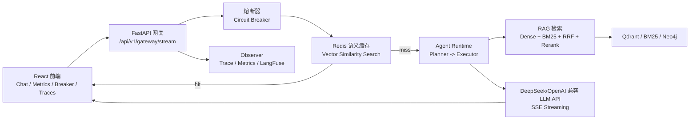
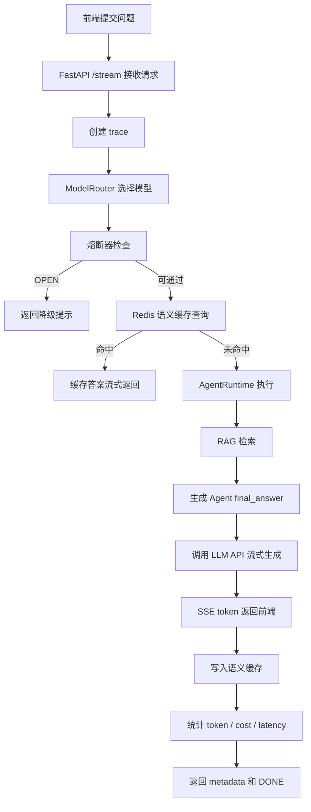
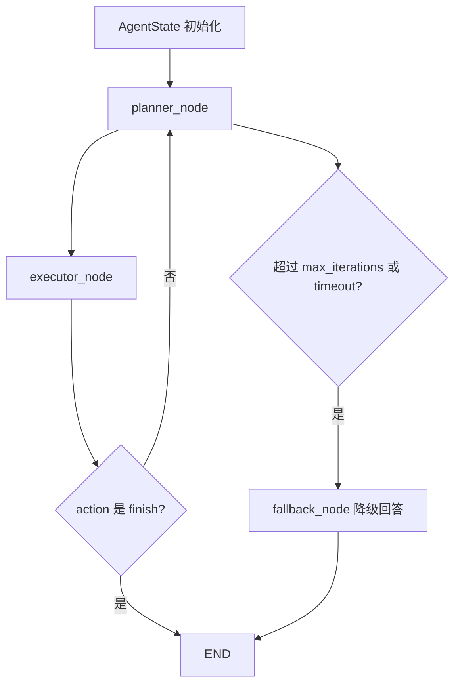
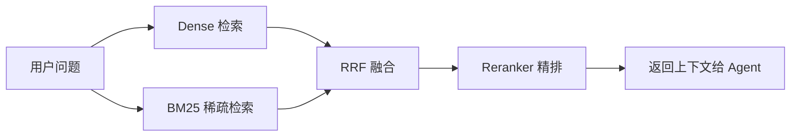
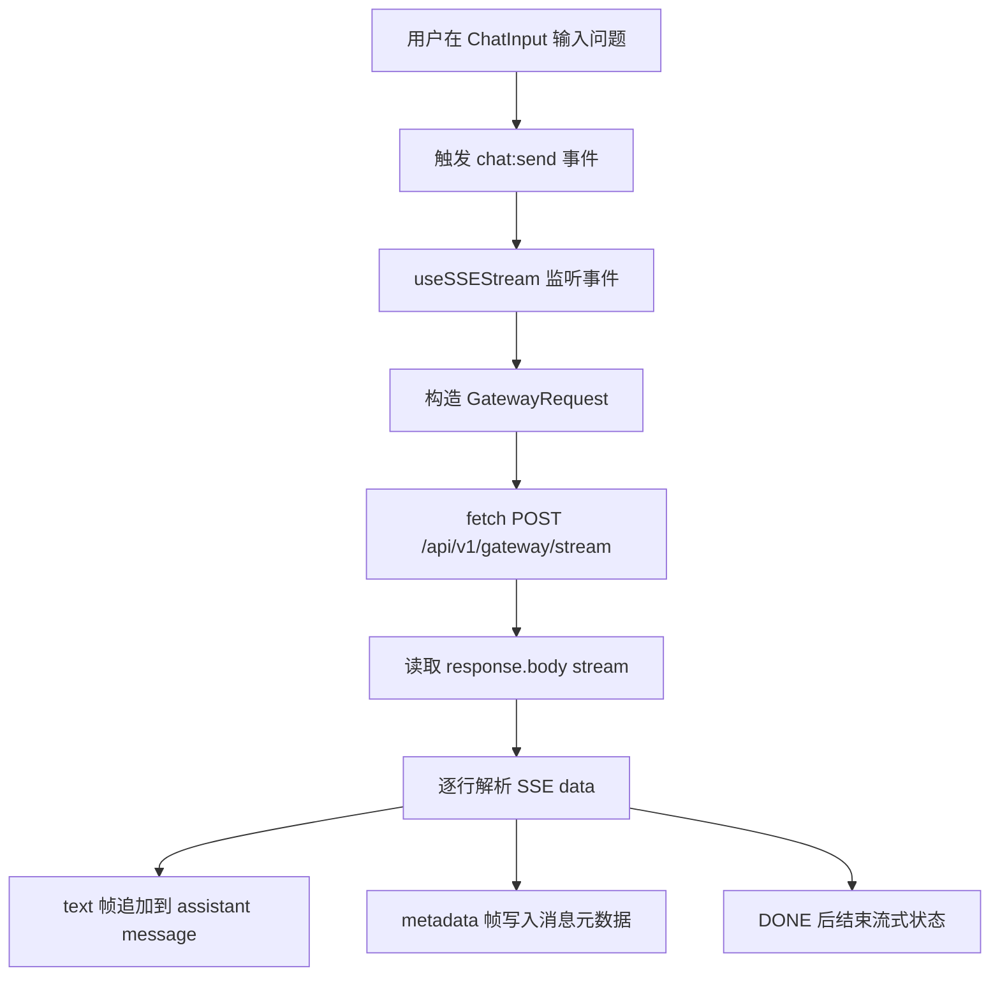

# KGateway 项目流程梳理

## 1. 项目定位

KGateway 是一个企业级 LLM 网关项目。整体目标是把用户的提问统一接入网关，然后经过熔断保护、语义缓存、Agent 编排、RAG 检索、模型路由和流式生成，最后通过 SSE 返回给前端。

项目由两部分组成：

- 后端：FastAPI，负责网关 API、LLM 调用、RAG、缓存、熔断、监控。
- 前端：React + Vite，负责聊天界面、指标看板、熔断器页面、链路追踪页面。

## 2. 总体架构

## 3. 后端启动流程

后端入口文件：

`KGateway/src/main.py`

FastAPI 启动时会先加载 `.env`，然后通过 `lifespan` 初始化核心组件：

1. `ModelRouter`
   - 根据请求复杂度选择模型。
   - 普通问题默认走基础模型。
   - 开启 `advanced_reasoning` 或问题过长时走高级推理模型。

2. `SparseRetriever`
   - 内存版 BM25 检索器。
   - 支持 `tenant_id + department` 维度隔离。

3. `Reranker`
   - BGE CrossEncoder 精排模型。
   - 加载失败时会降级，不阻塞主流程。

4. `AgentRuntime`
   - 状态机 Agent。
   - 默认最多执行 4 轮。
   - 超时或异常时进入 fallback。

5. `SemanticCacheManager`
   - Redis 语义缓存。
   - 通过向量相似度判断问题是否命中缓存。

6. `CircuitBreaker`
   - LLM API 熔断器。
   - 状态包括 `CLOSED`、`OPEN`、`HALF_OPEN`。

7. `GatewayObserver`
   - 本地 trace 和 metrics 聚合。
   - 如果配置 LangFuse key，则额外上报 LangFuse。

8. `QdrantVectorStore` 和 `GraphRepository`
   - 分别连接 Qdrant 和 Neo4j。
   - 当前主问答链路里 Qdrant 初始化了，但 Dense 检索仍是 mock。

## 4. Docker 编排

Docker 配置文件：

`KGateway/docker-compose.yml`

主要服务：

| 服务 | 端口 | 作用 |
|---|---:|---|
| Redis | 6379 | 语义缓存 |
| Qdrant | 6333 / 6334 | 向量数据库 |
| Neo4j | 7474 / 7687 | 图数据库 |
| Gateway | 8000 | FastAPI 网关 |

启动后后端主服务访问地址：

`http://localhost:8000`

常用接口：

- `GET /health`
- `POST /api/v1/gateway/stream`
- `GET /api/v1/gateway/metrics`
- `GET /docs`

## 5. 用户提问主流程

核心接口：

`POST /api/v1/gateway/stream`

代码位置：

`KGateway/src/api/routes.py`

请求体结构来自：

`KGateway/src/core/schemas.py`

核心字段：

- `user_id`
- `tenant_id`
- `department`
- `question`
- `session_id`
- `advanced_reasoning`

完整处理流程如下：

### 5.1 模型路由

代码位置：

`KGateway/src/core/router.py`

当前路由规则：

- `advanced_reasoning = true`：走高级推理模型。
- 问题长度超过阈值：走高级推理模型。
- 其他情况：走基础模型。

默认模型常量：

- 基础模型：`qwen3-8b-instruct`
- 高级模型：`deepseek-r1`
- 高级模型 fallback：`claude-3.5-sonnet`

注意：虽然 `ModelRouter` 有模型后端抽象，但主 SSE 流程里实际调用 LLM 的地方是 `_stream_llm_api()`。

### 5.2 熔断器

代码位置：

`KGateway/src/core/protection.py`

熔断器状态：

- `CLOSED`：正常放行。
- `OPEN`：拒绝请求，返回降级提示。
- `HALF_OPEN`：恢复探测阶段。

当 LLM API 多次失败后，熔断器会打开，避免继续压垮上游服务。

### 5.3 语义缓存

代码位置：

`KGateway/src/core/cache.py`

流程：

1. 对用户问题做 embedding。
2. 到 Redis Vector Similarity Search 中查同租户下的相似问题。
3. 如果相似度达到阈值，则直接返回缓存答案。
4. 如果未命中，则走 Agent + RAG + LLM。
5. 最终生成完成后，把新问答写回 Redis。

## 6. Agent Runtime 流程

代码位置：

`KGateway/src/agents/runtime.py`

Agent 是一个确定性状态机，不依赖 LangChain。

可用工具设计：

- `query_local_knowledge`
  - 调用 RAG 混合检索。

- `web_search`
  - 当前是 mock。

- `finish`
  - 输出最终回答。

当前实现重点：

- 第一轮 Planner 固定选择 `query_local_knowledge`。
- 如果拿到 RAG 上下文，第二轮 Planner 选择 `finish`。
- Planner 目前是演示策略，并没有真正调用 LLM 来做工具规划。

## 7. RAG 检索流程

RAG 流水线在：

`KGateway/src/api/routes.py`

函数：

`_rag_pipeline()`

流程：

当前细节：

- Dense 检索现在是 `_mock_dense_search()`，还没有真正接入 Qdrant 检索。
- BM25 是内存索引，代码在 `KGateway/src/db/bm25_client.py`。
- RRF 融合代码在 `KGateway/src/core/fusion.py`。
- Reranker 代码在 `KGateway/src/core/reranker.py`。

## 8. LLM 流式生成

代码位置：

`KGateway/src/api/routes.py`

函数：

`_stream_llm_api()`

逻辑：

1. 如果 `.env` 中没有配置 `LLM_API_KEY`，则使用 `_simulate_llm_tokens()` 返回 mock token。
2. 如果配置了 `LLM_API_KEY`，则调用 `LLM_API_URL`。
3. 默认 API 地址是 DeepSeek 的 OpenAI 兼容接口。
4. 后端逐行解析上游 SSE，把 token 转发给前端。

默认配置来自：

`KGateway/src/config.py`

关键环境变量：

- `LLM_API_URL`
- `LLM_API_KEY`
- `LLM_MODEL`
- `EMBEDDING_MODEL`
- `REDIS_URL`
- `QDRANT_URL`
- `NEO4J_URI`

## 9. 前端流程

前端入口：

`KGateway/frontend/src/App.tsx`

页面路由：

| 路径 | 页面 | 作用 |
|---|---|---|
| `/` | `ChatPage` | 聊天主界面 |
| `/dashboard` | `DashboardPage` | 指标看板 |
| `/breaker` | `BreakerPage` | 熔断器状态 |
| `/traces` | `TracesPage` | 链路追踪 |

聊天页核心文件：

- `KGateway/frontend/src/pages/ChatPage.tsx`
- `KGateway/frontend/src/hooks/useSSE.ts`
- `KGateway/frontend/src/stores/chat.ts`

前端聊天流程：

## 10. 可观测性与指标

代码位置：

`KGateway/src/core/observability.py`

每次请求会记录：

- `trace_id`
- `tenant_id`
- `user_id`
- `session_id`
- `cache_hit`
- `model_used`
- `total_tokens`
- `estimated_cost_usd`
- `ttft_ms`
- `total_latency_ms`
- 各阶段 span 耗时

后端指标接口：

`GET /api/v1/gateway/metrics`

返回内容包括：

- 累计请求数
- 缓存命中率
- token 总数
- 成本估算
- 平均延迟
- 延迟分布
- 熔断器状态

## 11. 当前实现中的注意点

下面这些是读代码时看到的真实状态：

1. README 和部分源码注释在当前环境显示为乱码，应该是编码显示问题。

2. 前端 Dashboard 调用的是：
   - `/api/v1/monitor/metrics`
   - `/api/v1/monitor/traces`

   但后端实际暴露的是：
   - `/api/v1/gateway/metrics`

   这里前后端接口没有对齐。

3. `KGateway/src/config.py` 中 `ModelPricing.output_price_per_1k` 的缩进看起来异常，可能导致 Python 语法错误，需要实际运行确认。

4. Dense 检索目前是 mock，没有真正调用 Qdrant。

5. Agent Planner 当前是硬编码演示逻辑，不是真 LLM 工具规划。

6. Neo4j 已初始化连接，但主问答链路暂时没有明显使用。

7. 如果没有配置 `LLM_API_KEY`，LLM 会走 mock token 输出，因此看起来能流式返回，但并不是实际模型回答。

## 12. 一句话总结

KGateway 的目标架构是：

前端聊天请求进入 FastAPI 网关，先经过熔断和语义缓存，缓存未命中时进入 Agent，Agent 调用 RAG 检索企业知识，再把结果交给 LLM 流式生成，最后通过 SSE 返回前端，同时记录 trace、metrics、token 和成本。

当前项目整体架构清楚，但仍有一些演示实现和接口未对齐的地方，需要进一步联调和修正后才能作为完整生产链路运行。
