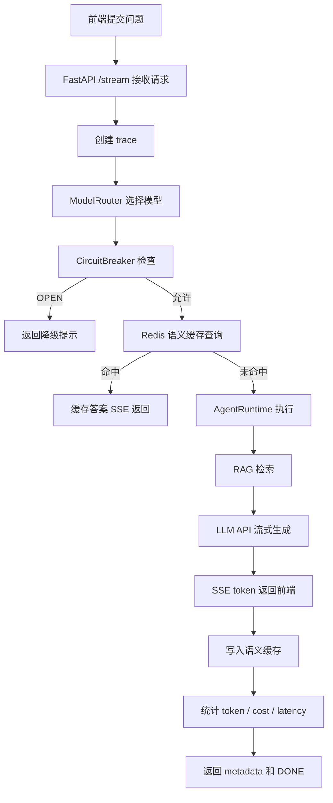

# KAgent

**企业级 LLM 网关控制台 —— 统一路由、语义缓存、RAG 检索、熔断保护、成本管控、链路追踪**

```text
██╗  ██╗ ██████╗  █████╗ ████████╗███████╗██╗    ██╗ █████╗ ██╗   ██╗
██║ ██╔╝██╔════╝ ██╔══██╗╚══██╔══╝██╔════╝██║    ██║██╔══██╗╚██╗ ██╔╝
█████╔╝ ██║  ███╗███████║   ██║   █████╗  ██║ █╗ ██║███████║ ╚████╔╝
██╔═██╗ ██║   ██║██╔══██║   ██║   ██╔══╝  ██║███╗██║██╔══██║  ╚██╔╝
██║  ██╗╚██████╔╝██║  ██║   ██║   ███████╗╚███╔███╔╝██║  ██║   ██║
╚═╝  ╚═╝ ╚═════╝ ╚═╝  ╚═╝   ╚═╝   ╚══════╝ ╚══╝╚══╝ ╚═╝  ╚═╝   ╚═╝
```

[](https://www.python.org/)
[](https://fastapi.tiangolo.com/)
[](https://react.dev/)
[](https://vite.dev/)
[](https://www.docker.com/)

---

## 🎯 项目概览

KAgent 是一个面向企业 AI 应用的 **LLM 网关 + 前端运维控制台**。它把用户问题统一接入后端网关，经过模型路由、熔断保护、语义缓存、Agent 编排、RAG 检索和 LLM 流式生成后，再由 React 控制台展示聊天结果、运行指标、熔断器状态和链路追踪。

它的目标不是只完成一次模型调用，而是把模型调用包装成可控制、可观测、可降级、可扩展的企业级基础设施。

```text
┌────────────────────────────────────────────────────────────────────┐
│                         KAgent Platform                          │
├────────────────────────────────────────────────────────────────────┤
│                                                                    │
│  React 控制台                                                       │
│  Chat / Dashboard / Breaker / Traces / Guide                       │
│          │                                                         │
│          ▼                                                         │
│  FastAPI 网关：/api/v1/gateway/stream                               │
│          │                                                         │
│          ├── Circuit Breaker：三态熔断保护                           │
│          ├── Semantic Cache：Redis VSS 语义缓存                      │
│          ├── Model Router：基础模型 / 高级推理模型路由                │
│          ├── Agent Runtime：Planner -> Executor 状态机               │
│          ├── Hybrid RAG：Dense + BM25 + RRF + Reranker               │
│          └── Observability：Metrics / Traces / LangFuse              │
│                                                                    │
│  Infrastructure：Redis / Qdrant / Neo4j / Docker Compose            │
│                                                                    │
└────────────────────────────────────────────────────────────────────┘
```

---

## 💎 核心能力

| 能力 | 描述 | 代码位置 |
|---|---|---|
| **SSE 流式网关** | 主接口使用 Server-Sent Events 返回 token 流和 metadata | `后端/src/api/routes.py` |
| **应用编排层** | `ChatOrchestrator` 串联熔断、缓存、Agent、生成和观测 | `后端/src/application/orchestrator.py` |
| **动态模型路由** | 根据 `advanced_reasoning` 和问题长度选择模型，并统计成本 | `后端/src/core/router.py` |
| **Redis 语义缓存** | 使用 Redis VSS 按租户查询相似问题，命中后跳过模型调用 | `后端/src/core/cache.py` |
| **三态熔断器** | CLOSED / OPEN / HALF_OPEN 保护上游 LLM 服务 | `后端/src/core/protection.py` |
| **Agent Runtime** | 确定性 Planner -> Executor 状态机，最多 4 轮迭代 | `后端/src/agents/runtime.py` |
| **RAG 融合检索** | Dense 与 BM25 双路召回，RRF 融合后再精排 | `后端/src/core/fusion.py` |
| **链路追踪和指标** | 记录 trace、延迟、token、成本、缓存命中和熔断状态 | `后端/src/core/observability.py` |
| **前端控制台** | 聊天、指标看板、熔断器管理、trace 查询和使用说明 | `前端/src/pages` |

---

## 🔁 请求流程



---

## 🏗️ 技术栈

```text
┌─────────────────────────────────────────────────────────────────────┐
│                        TECHNOLOGY STACK                             │
├─────────────────────────────────────────────────────────────────────┤
│ 后端                                                                 │
│   Python 3.11+                                                       │
│   FastAPI + Uvicorn                 异步 Web 网关                     │
│   Pydantic v2                       请求/响应模型和配置管理           │
│   sentence-transformers             Embedding + Reranker              │
│   rank-bm25 + jieba                 中文稀疏检索                      │
│                                                                     │
│ 存储和基础设施                                                        │
│   Redis Stack                        语义缓存和 VSS                   │
│   Qdrant                             向量数据库                       │
│   Neo4j                              图数据库                         │
│   Docker Compose                     本地一键编排                     │
│                                                                     │
│ 前端                                                                 │
│   React 19 + TypeScript              控制台 UI                        │
│   Vite 8                             构建工具                         │
│   Tailwind CSS 4                     样式系统                         │
│   Zustand                            状态管理                         │
│   Recharts                           指标图表                         │
│   Lucide React                       图标                             │
│                                                                     │
│ 可观测性                                                              │
│   Local Metrics                      请求、延迟、成本、缓存命中         │
│   Trace Store                        最近请求链路记录                  │
│   LangFuse                           可选远程追踪上报                  │
└─────────────────────────────────────────────────────────────────────┘
```

---

## 🚀 快速开始

### 环境要求

- Docker 和 Docker Compose
- Python 3.11+（本地后端开发）
- Node.js 20+（本地前端开发）

### 1. 启动后端基础服务和网关

```bash
cd KAgent/后端
docker-compose up -d
```

启动的服务：

| 服务 | 端口 | 说明 |
|---|---:|---|
| `kgw-redis` | `6379` | Redis Stack，语义缓存 |
| `kgw-qdrant` | `6333` / `6334` | 向量数据库 |
| `kgw-neo4j` | `7474` / `7687` | 图数据库 |
| `kgw-gateway` | `8000` | FastAPI 网关 |

验证后端：

```bash
curl http://localhost:8000/health
curl http://localhost:8000/api/v1/monitor/metrics
```

Swagger 文档：

```text
http://localhost:8000/docs
```

### 2. 本地启动前端

```bash
cd KAgent/前端
npm install
npm run dev
```

默认访问：

```text
http://localhost:5173
```

如需指定后端地址：

```env
VITE_API_BASE=http://localhost:8000
```

---

## 📡 API 接口

### 主接口

**POST** `/api/v1/gateway/stream`

SSE 流式网关接口，前端聊天页通过该接口接收 token 流、错误帧和 metadata。

```json
{
  "user_id": "user_001",
  "tenant_id": "tenant_acme",
  "department": "engineering",
  "question": "请说明当前系统的熔断保护机制",
  "session_id": "session_001",
  "advanced_reasoning": false
}
```

| 字段 | 类型 | 必填 | 说明 |
|---|---|---:|---|
| `user_id` | string | 是 | 用户标识 |
| `tenant_id` | string | 是 | 租户标识，用于缓存和检索隔离 |
| `department` | enum | 否 | 部门维度，如 `legal`、`hr`、`engineering`、`finance`、`general` |
| `question` | string | 是 | 用户问题 |
| `session_id` | string | 否 | 会话标识 |
| `advanced_reasoning` | bool | 否 | 是否启用高级推理模型 |

### SSE 返回示例

```text
data: {"protocol_version":"gateway.sse.v1","status":"text","event":"text","text":"正在生成..."}

data: {"protocol_version":"gateway.sse.v1","status":"metadata","event":"metadata","text":"","cache_hit":false,"model":"qwen3-8b-instruct","total_tokens":256}

data: [DONE]
```

### 监控和运维接口

| 方法 | 路径 | 说明 |
|---|---|---|
| `GET` | `/health` | 健康检查 |
| `GET` | `/api/v1/gateway/contract` | SSE 协议说明 |
| `GET` | `/api/v1/monitor/metrics` | 运行指标 |
| `GET` | `/api/v1/monitor/traces?limit=100&offset=0` | trace 列表 |
| `GET` | `/api/v1/monitor/circuit-breaker` | 熔断器状态 |
| `POST` | `/api/v1/monitor/circuit-breaker/force-open` | 手动打开熔断器 |
| `POST` | `/api/v1/monitor/circuit-breaker/force-close` | 手动关闭熔断器 |
| `GET` | `/api/v1/gateway/metrics` | 兼容性指标接口 |

---

## 🖥️ 前端控制台

| 页面 | 路径 | 说明 |
|---|---|---|
| Chat | `/` | 主聊天页，支持参数面板、SSE 流式回答和 metadata 展示 |
| Dashboard | `/dashboard` | 指标看板，展示请求量、延迟、成本和近期请求 |
| Breaker | `/breaker` | 熔断器状态和管理页面 |
| Traces | `/traces` | trace 列表、过滤、分页和详情查看 |
| Guide | `/guide` | 使用说明和演示引导 |

前端将接口地址集中维护在：

```text
前端/src/lib/gateway.ts
前端/src/lib/http.ts
前端/src/hooks/useSSE.ts
```

---

## 📁 项目结构

```text
KAgent/
├── README.md
├── 后端/
│   ├── Dockerfile.gateway
│   ├── docker-compose.yml
│   ├── requirements.txt
│   ├── src/
│   │   ├── main.py                         # FastAPI 应用入口
│   │   ├── config.py                       # 环境变量配置
│   │   ├── api/routes.py                   # 网关和监控接口
│   │   ├── application/
│   │   │   ├── orchestrator.py             # ChatOrchestrator 编排中心
│   │   │   ├── chat_flows.py               # 缓存命中和生成流输出
│   │   │   ├── rag_service.py              # Hybrid RAG 服务
│   │   │   ├── stream_contract.py          # SSE 协议帧
│   │   │   └── streaming_tasks.py          # 流式任务和断连检测
│   │   ├── agents/runtime.py               # Agent 状态机
│   │   ├── core/
│   │   │   ├── cache.py                    # Redis 语义缓存
│   │   │   ├── router.py                   # 模型路由和成本估算
│   │   │   ├── protection.py               # 熔断器
│   │   │   ├── fusion.py                   # RRF 融合
│   │   │   ├── reranker.py                 # CrossEncoder 精排
│   │   │   ├── observability.py            # 指标和 trace
│   │   │   └── schemas.py                  # Pydantic 模型
│   │   └── db/
│   │       ├── bm25_client.py              # BM25 稀疏检索
│   │       ├── qdrant_client.py            # Qdrant 向量库
│   │       └── neo4j_client.py             # Neo4j 图数据库
│   └── tests/
│       ├── test_storage.py
│       ├── benchmark_metrics.py
│       └── locustfile.py
│
├── 前端/
│   ├── package.json
│   ├── vite.config.ts
│   ├── src/
│   │   ├── App.tsx                         # 路由入口
│   │   ├── layouts/AppLayout.tsx           # 控制台布局
│   │   ├── pages/                          # Chat / Dashboard / Breaker / Traces / Guide
│   │   ├── components/                     # 页面组件
│   │   ├── stores/                         # Zustand 状态
│   │   ├── lib/                            # HTTP 和网关协议
│   │   └── hooks/useSSE.ts                 # SSE 流式 Hook
│   └── public/
│
└── spec文件夹/
    ├── 项目流程梳理.md
    ├── 解耦重构Spec.md
    ├── 前端UI修复与科技蓝重设计Spec.md
    └── 代码治理Spec.md
```

---

## ⚙️ 环境变量参考

| 变量 | 默认值 | 说明 |
|---|---|---|
| `KAGENT_DEBUG` | `false` | 是否开启调试模式 |
| `KAGENT_DATABASE_URL` | `sqlite+aiosqlite:///data/gateway.db` | 网关数据库连接 |
| `QDRANT_URL` | `http://localhost:6333` | Qdrant 地址 |
| `QDRANT_API_KEY` | 空 | Qdrant API Key |
| `QDRANT_COLLECTION` | `kagent_vectors` | 向量集合名 |
| `NEO4J_URI` | `bolt://localhost:7687` | Neo4j 地址 |
| `NEO4J_USER` | `neo4j` | Neo4j 用户名 |
| `NEO4J_PASSWORD` | 空 | Neo4j 密码 |
| `REDIS_URL` | `redis://localhost:6379` | Redis 地址 |
| `REDIS_CACHE_TTL_HOURS` | `12` | 缓存过期时间 |
| `REDIS_CACHE_THRESHOLD` | `0.2` | 语义缓存距离阈值 |
| `CB_FAILURE_THRESHOLD` | `5` | 熔断失败次数阈值 |
| `CB_RECOVERY_TIMEOUT` | `60` | 熔断恢复时间，单位秒 |
| `LANGFUSE_PUBLIC_KEY` | 空 | LangFuse Public Key |
| `LANGFUSE_SECRET_KEY` | 空 | LangFuse Secret Key |
| `LANGFUSE_HOST` | `https://cloud.langfuse.com` | LangFuse 地址 |
| `LLM_API_URL` | `https://api.deepseek.com/v1/chat/completions` | LLM API 地址 |
| `LLM_API_KEY` | 空 | LLM API Key |
| `LLM_MODEL` | `deepseek-chat` | 默认 LLM 模型 |
| `EMBEDDING_MODEL` | `BAAI/bge-base-zh-v1.5` | Embedding 模型 |
| `KAGENT_ADV_THRESHOLD` | `2000` | 高级推理路由长度阈值 |
| `VITE_API_BASE` | 当前域名 | 前端请求后端基础地址 |

---

## 📊 设计目标和当前状态

| 指标 | 目标 | 当前状态 |
|---|---|---|
| SSE 流式输出 | 支持 token 流、metadata 和 DONE 帧 | 已实现 |
| Agent 迭代安全 | 最多 4 轮，有超时和 fallback | 已实现 |
| 熔断保护 | CLOSED / OPEN / HALF_OPEN 三态 | 已实现 |
| 语义缓存 | Redis VSS 命中后直接返回 | 已实现 |
| 多租户隔离 | 请求携带 `tenant_id` 和 `department` | 已具备基础字段 |
| Dense 检索 | Qdrant 主链路检索 | 待进一步接入 |
| 压测指标 | RPS、p95、p99、缓存命中率 | 待压测验证 |

---

## 🧪 测试

### 后端单元测试

```bash
cd KAgent/后端
pip install -r requirements.txt
pytest tests/test_storage.py -v
```

### 后端压测

```bash
cd KAgent/后端
locust -f tests/locustfile.py \
  --host=http://localhost:8000 \
  --users=100 \
  --spawn-rate=10 \
  --run-time=5m
```

### 前端构建检查

```bash
cd KAgent/前端
npm install
npm run build
```

---

## 🧭 后续计划

- 将主链路 Dense 检索完整接入 Qdrant。
- 增强 Agent Planner，使工具选择更智能。
- 补齐接口契约测试、SSE 帧测试和端到端测试。
- 完善认证鉴权、权限控制和生产部署配置。
- 优化前端移动端布局、错误重试和空状态体验。
- 输出真实压测报告，补充 p95、p99、吞吐量和缓存命中率数据。

---

## 🤝 参与贡献

欢迎提交 Issue、改进建议或 Pull Request。

1. Fork 本仓库
2. 创建特性分支：`git checkout -b feature/amazing-feature`
3. 提交更改：`git commit -m "feat: add amazing feature"`
4. 推送分支：`git push origin feature/amazing-feature`
5. 开启 Pull Request

---

## 📄 许可证

请根据仓库实际授权补充 `LICENSE`。如果使用 MIT 协议，可在根目录添加 MIT License 文件。

---

<p align="center">
  <b>Built for Enterprise AI Infrastructure</b>
</p>
